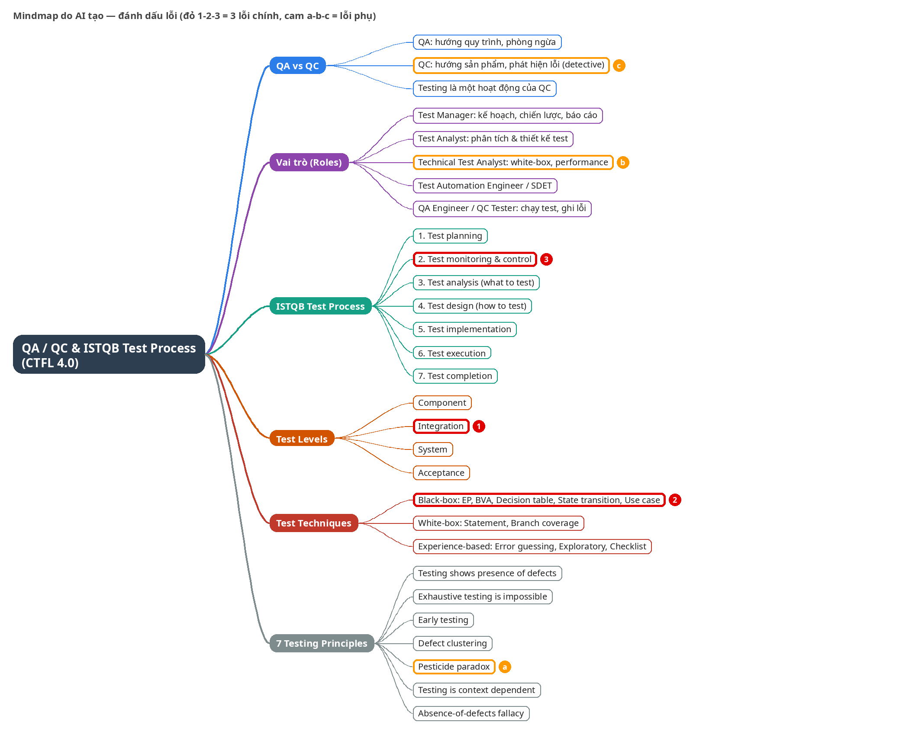

# Báo cáo HW01-AI — QA/QC Jobs · 20 Defects · Test a Physical Product

| Mục | Giá trị |
|---|---|
| Sinh viên | Nguyễn Phú Dinh — 23120031 |
| Mã bài tập | HW01-AI (Cấp độ AI 4) |
| Repo Git | https://github.com/d1nhnguyen/hw01_23120031.git |
| Ngày làm bài | 28/09/2026 – 30/09/2026 |

> Báo cáo được viết tóm tắt. Nội dung đầy đủ nằm trong các file kèm theo (jobs.md, defects.md, testcases.md, các file Excel, AI-02, AI-03, AI-05, prompt_log.md).

## 1. Yêu cầu 1 — Thị trường việc làm QA/QC 2026+

10 tin (ITviec 8, LinkedIn 2), ≥ 3 tin yêu cầu AI (tin 6, 9, 10), ảnh chụp ngày 29/09/2026 có tên tài khoản. Lương ghi theo trang hiển thị (tin không hiển thị ghi "Không công bố"). Ảnh: `req1-jobs/screenshots/` (job1.png, job2.png, job3.png, job4.png, job5.png, job6_AI.png, job7.png, job8.png, job9_AI.png, job10_AI.png). Chi tiết đầy đủ: [req1-jobs/jobs.md](../req1-jobs/jobs.md).

| # | Vị trí — công ty (link) | Lương | Mô tả công việc | Kỹ năng yêu cầu | Yêu cầu AI |
|---|---|---|---|---|---|
| 1 | [QIG — Manual Tester](https://itviec.com/viec-lam-it/manual-tester-qa-qc-cong-ty-co-phan-tap-doan-cong-nghe-quang-ich-qig-3723) | 500–1,200 USD | lập test plan/test case, thực thi, ghi bug, báo cáo, đề xuất cải tiến, đào tạo CSKH | ≥ 2 năm test, hiểu kỹ thuật test, kinh nghiệm web/mobile | Không |
| 2 | [Saritasa — QA Engineer](https://itviec.com/viec-lam-it/qa-engineer-tester-qa-qc-english-up-to-1500-saritasa-4856) | 1,000–1,500 USD | trang chỉ nêu giới thiệu công ty (VR/AR/IoT/web/mobile/game, làm việc cùng team Nga) | ≥ 3 năm Manual QA (ưu tiên automation), JMeter/Postman, Git, Linux, tiếng Anh; điểm cộng dùng AI thiết kế test | Điểm cộng |
| 3 | [GoldenGate — Junior/Middle QA](https://itviec.com/viec-lam-it/junior-middle-software-qa-tester-qa-qc-cong-ty-tnhh-dich-vu-gia-tri-gia-tang-goldengate-4907) | Không công bố | quản lý dự án test, lập và thực thi test plan, phối hợp dev, tối ưu quy trình, báo cáo test | ≥ 2 năm test, CNTT; công cụ test/automation là lợi thế | Không |
| 4 | [MiTek Vietnam — Manual/Automation Tester](https://itviec.com/viec-lam-it/manual-automation-tester-selenium-qa-qc-mitek-vietnam-0430) | Không công bố | thiết kế test case, viết/bảo trì script automation Web/Windows/API, theo dõi lỗi, làm việc với team Mỹ | ≥ 3 năm test manual + automation, Agile, tiếng Anh; SQL/Postman/CI-CD/Python là điểm cộng | Không |
| 5 | [Saigon Technology — Middle/Senior Automation QC](https://itviec.com/viec-lam-it/middle-senior-automation-qc-tester-qa-qc-saigon-technology-4350) | Không công bố | xây và bảo trì framework automation (UI, API, E2E), báo cáo cho client, phối hợp QC Lead/dev/DevOps | ≥ 4 năm Playwright, POM, JS/TS, CI/CD, API, Zephyr/Qase; điểm cộng AI trong automation | Điểm cộng |
| 6 | [TrustedAI — Automation Tester](https://itviec.com/viec-lam-it/automation-tester-qa-qc-tester-japanese-n3-trustedai-2550) | 800–1,500 USD | thiết kế quy trình test theo rủi ro, test chức năng/hồi quy đa trình duyệt và đa ngôn ngữ, tự động hoá test, tài liệu test | ≥ 3 năm, automation và ứng dụng AI, tiếng Nhật ≥ N3, đọc tài liệu Anh; test AI/chatbot là điểm cộng | Có |
| 7 | [ECARX — Process Quality Assurance](https://itviec.com/viec-lam-it/process-quality-assurance-pqa-qa-qc-cong-ty-tnhh-ecarx-4345) | Salary up to 50M+ Year-end bonus | quản lý issue trong vòng đời dự án, kế hoạch audit phần mềm, Jira board/dashboard, hệ thống chất lượng ASPICE | cử nhân CNTT, ≥ 3 năm QA, Agile, Jira, tiếng Anh | Không |
| 8 | [OL Vietnam — QA Engineer](https://itviec.com/it-jobs/qa-engineer-tester-qa-qc-ol-vietnam-3927) | Không công bố | thiết kế và thực thi chiến lược manual test, kiểm tra các bản release, đánh giá từ góc nhìn người dùng | manual test ứng dụng phức tạp, tiếng Anh; điểm cộng WCAG, Cypress/Selenium | Không |
| 9 | [SCC — AI QA Engineer (LinkedIn)](https://www.linkedin.com/jobs/view/ai-qa-engineer-at-scc-4464451720/) | Không công bố | SIT/FAT với team UK, test chat AI "Scout" trên MS Teams, dữ liệu CRM, tuân thủ EU AI Act | 2–4 năm test phần mềm/AI, test giao diện hội thoại/ứng dụng AI, Azure AI, MS Teams, CRM, Agile | Có |
| 10 | [Ins Enco — Senior QA Engineer, AI-Augmented (LinkedIn)](https://www.linkedin.com/jobs/view/senior-qa-engineer-ai-augmented-quality-engineering-4466589603/) | 30–40 triệu VND gross/tháng | chiến lược test manual/automation/AI-assisted, E2E Playwright, API test, CI/CD, dùng GPT/Claude sinh test | 3–6 năm QA, Playwright, Postman/Bruno, SQL, CI/CD, Jira+Xray; bắt buộc GPT/Claude sinh test, Mabl/Testim, Applitools | Có |

### AI Impact Analysis

1. **Tin 1:** AI có thể hỗ trợ sinh test case và dữ liệu test từ mô tả nghiệp vụ, nhưng việc phân tích nghiệp vụ, đánh giá mức độ nghiêm trọng của bug và đào tạo bộ phận CSKH vẫn cần con người. Tin không yêu cầu AI, tác động chủ yếu gián tiếp: nhà tuyển dụng có thể kỳ vọng năng suất cao hơn nhờ AI.
2. **Tin 2:** Tin xem việc dùng công cụ AI để tăng tốc thiết kế test là điểm cộng, tức AI hỗ trợ (assist) chứ không thay thế. Các việc như đọc hiểu spec, test tích hợp/API và ghi bug kèm ảnh/video vẫn do tester thực hiện.
3. **Tin 3:** Các việc lặp lại như viết báo cáo kiểm thử và test plan mẫu có thể được AI hỗ trợ, nên vị trí Junior dễ bị thu hẹp phần việc đơn giản. Quản lý tiến độ/ngân sách test và phối hợp với dev vẫn cần con người.
4. **Tin 4:** AI code assistant có thể hỗ trợ viết, debug và refactor script automation cho Web/API, giúp giảm thời gian bảo trì. Thiết kế kịch bản test, test ứng dụng Windows và phối hợp với team Mỹ vẫn cần tester; script do AI sinh phải được review vì dễ thiếu ổn định.
5. **Tin 5:** AI trong automation là điểm cộng: AI có thể sinh nhanh script Playwright và Page Object, nhưng việc thiết kế framework, chiến lược test và review code do AI sinh vẫn thuộc về QC Senior. Vai trò dịch chuyển từ viết script sang thiết kế và kiểm duyệt.
6. **Tin 6:** Đây là tin yêu cầu AI trực tiếp: AI vừa là công cụ hỗ trợ automation, vừa là đối tượng phải test (chatbot/NLP). Test đa ngôn ngữ Nhật–Việt–Anh cần người kiểm chứng ngữ cảnh mà AI dễ đánh giá sai.
7. **Tin 7:** Tin không nhắc AI. AI có thể hỗ trợ tổng hợp báo cáo, dashboard Jira và checklist audit, nhưng thương lượng với khách hàng và xây dựng hệ thống chất lượng theo ASPICE cần phán đoán của con người, nên vai trò này ít bị thay thế nhất.
8. **Tin 8:** Manual test ứng dụng phức tạp, đánh giá từ góc nhìn người dùng và accessibility (WCAG) khó thay bằng AI, chỉ được AI hỗ trợ sinh test case. Vì automation được xem là điểm cộng, ứng viên chỉ manual có áp lực phải nâng kỹ năng.
9. **Tin 9:** Đối tượng test là một AI agent (độ chính xác hội thoại, tuân thủ EU AI Act), nên AI không thể tự kiểm chứng chính nó. Nhu cầu QA cho hệ thống AI tăng, đòi hỏi kỹ năng đánh giá kết quả không xác định trước (non-deterministic).
10. **Tin 10:** AI (GPT/Claude, Postbot, Mabl/Testim) có thể đảm nhận phần sinh test case, edge case và phân tích log lặp lại. QA chuyển sang thiết kế chiến lược, kiểm duyệt kết quả AI và tích hợp CI/CD — đây là mô hình QA "AI-augmented".

### Mindmap QA/QC và 3 lỗi của AI (G9.1)

| # | AI vẽ | Đúng theo ISTQB CTFL v4.0.1 |
|---|---|---|
| 1 | Test Levels có 4 mức | 5 mức: component, component integration, system, system integration, acceptance (§2.2.1) |
| 2 | Use case testing thuộc black-box | CTFL 4.0 chỉ có 4 kỹ thuật black-box; use case testing đã bị bỏ (§4.2, phụ lục thay đổi) |
| 3 | "Test monitoring & control" là bước 2 của chuỗi | Hoạt động chạy liên tục, các hoạt động thường lặp hoặc song song (§1.4.1) |

Đã kiểm chứng độc lập bằng Codex. Bản mindmap đã sửa và 3 lỗi phụ: [req1-jobs/mindmap/qa-qc-roles.md](../req1-jobs/mindmap/qa-qc-roles.md).

## 2. Yêu cầu 2 — 20 lỗi phần mềm 2022–2026

20 lỗi trong khoảng 2022–2024, trong đó 5 lỗi liên quan AI/LLM (dòng 1–5: 3 prompt injection, 1 hallucination-like, 1 bias). Điểm CVSS đã đối chiếu với NVD. Nội dung chi tiết từng lỗi: [req2-defects/defects.md](../req2-defects/defects.md).

| # | Lỗi (năm) | Nguồn | Mô tả | Severity | Hậu quả | Giải pháp |
|---|---|---|---|---|---|---|
| 1 | LangChain LLMMathChain, CVE-2023-29374 (2023) — AI | [NVD](https://nvd.nist.gov/vuln/detail/CVE-2023-29374) | Output của LLM đi thẳng vào Python `exec()`; prompt injection làm mô hình sinh code tùy ý | Critical, CVSS v3.1 9.8 | Chạy code trong tiến trình, lộ API key/biến môi trường, chiếm server | Bỏ đường LLM → `exec()`; dùng parser/AST giới hạn, sandbox, least privilege |
| 2 | Vanna.AI, CVE-2024-5565 (2024) — AI | [JFrog](https://jfrog.com/blog/prompt-injection-attack-code-execution-in-vanna-ai-cve-2024-5565/) | Text-to-SQL sinh code Plotly từ câu hỏi và SQL rồi `exec()`; prompt injection nhiều tầng dẫn tới RCE | High, CVSS v3.1 8.1 (v4 Critical theo GitHub, chưa đối chiếu) | RCE trong tiến trình Vanna, lộ credential DB, chiếm database | LLM chỉ trả đặc tả biểu đồ (JSON) cho bộ render tin cậy; nếu vẫn chạy code thì AST validation và sandbox |
| 3 | EmailGPT, CVE-2024-5184 (2024) — AI | [CVE.org](https://www.cve.org/CVERecord?id=CVE-2024-5184) | Prompt injection trực tiếp làm lộ system prompt và chạy prompt ngoài thiết kế | High 8.5 (v4) / Medium 6.5 (v3.1) theo CNA; Critical 9.1 theo NVD | Lộ system prompt và quy trình nội bộ; nguy hiểm hơn nếu mô hình có quyền gọi tool | Không dùng prompt làm kiểm soát truy cập; policy engine và kiểm tra tham số; không để secret trong prompt |
| 4 | Air Canada chatbot, Moffatt v. Air Canada 2024 BCCRT 149 (sự cố 2022, phán quyết 2024) — AI | [CanLII](https://www.canlii.org/en/bc/bccrt/doc/2024/2024bccrt149/2024bccrt149.html) | Chatbot nói có thể xin giá vé tang lễ sau khi bay, trái chính sách thật; hồ sơ không nêu công nghệ nên gọi là "hallucination-like" | Medium (đánh giá tác động, không có CVSS) | Khách mua vé theo thông tin sai, tranh chấp, Air Canada bị xác định chịu trách nhiệm | Trả lời chính sách từ nguồn chuẩn (dịch vụ chính sách/RAG có trích dẫn), chuyển nhân viên khi không chắc |
| 5 | Meta Housing Ads (2022) — AI | [DOJ](https://www.justice.gov/crt/case/united-states-v-meta-platforms-inc-fka-facebook-inc-sdny) | Thuật toán phân phối quảng cáo nhà ở dùng đặc trưng gián tiếp liên quan nhóm được bảo vệ nên phân phối không đều | High (đánh giá tác động, không có CVSS) | Cơ hội nhà ở tiếp cận không đều, kiện tụng, phải đổi hệ thống | Bỏ Special Ad Audience; Variance Reduction System làm phân phối thực gần phân phối đủ điều kiện |
| 6 | Spring4Shell, CVE-2022-22965 (2022) | [NVD](https://nvd.nist.gov/vuln/detail/CVE-2022-22965) | Data binding của Spring trên JDK 9+ cho chỉnh thuộc tính nội bộ Tomcat, ghi file thực thi được | Critical 9.8 | RCE, web shell, đọc/sửa dữ liệu | Nâng Spring 5.3.18+/5.2.20+, dùng DTO tường minh, giới hạn field binding |
| 7 | Follina, CVE-2022-30190 (2022) | [MSRC](https://www.microsoft.com/en-us/msrc/blog/2022/05/guidance-for-cve-2022-30190-microsoft-support-diagnostic-tool-vulnerability) | Tài liệu Office gọi giao thức `ms-msdt:` để chạy lệnh, không cần macro | High 7.8 | Chạy code với quyền người dùng | Cập nhật Windows 6/2022; tạm thời tắt giao thức ms-msdt |
| 8 | Outlook NTLM leak, CVE-2023-23397 (2023) | [NVD](https://nvd.nist.gov/vuln/detail/CVE-2023-23397) | Thuộc tính nhắc hẹn trỏ tới đường dẫn SMB do kẻ tấn công kiểm soát; Outlook tự kết nối, không cần click | Critical 9.8 | Lộ credential NTLM, relay, di chuyển ngang | Vá Outlook; chặn SMB 445 ra Internet, tắt NTLM, bật SMB signing |
| 9 | MOVEit Transfer, CVE-2023-34362 (2023) | [NVD](https://nvd.nist.gov/vuln/detail/CVE-2023-34362) | SQL injection trong ứng dụng web, không cần xác thực | Critical 9.8 (CISA KEV) | Đánh cắp dữ liệu hàng loạt, web shell | Vá, kiểm tra IoC, xoay credential, dùng parameterized query |
| 10 | Cisco IOS XE, CVE-2023-20198 (2023) | [Cisco](https://www.cisco.com/c/en/us/support/docs/csa/cisco-sa-iosxe-webui-privesc-j22SaA4z.html) | Lỗi kiểm soát truy cập ở Web UI cho tạo tài khoản privilege 15; nối với CVE-2023-20273 lên root | Critical 10.0 | Chiếm thiết bị mạng, cấy implant | Nâng bản vá; tắt HTTP server nếu không cần; giới hạn quản trị bằng ACL/VPN |
| 11 | libwebp, CVE-2023-4863 (2023) | [NVD](https://nvd.nist.gov/vuln/detail/CVE-2023-4863) | Ghi tràn heap khi giải mã ảnh WebP được chế tạo | High 8.8 | Crash, có thể chạy code trong trình duyệt | libwebp 1.3.2+, cập nhật trình duyệt/ứng dụng, fuzz bộ giải mã |
| 12 | GitLab reset mật khẩu, CVE-2023-7028 (2024) | [GitLab](https://docs.gitlab.com/releases/patches/patch-release-gitlab-16-7-2-released/) | Email reset mật khẩu gửi tới địa chỉ chưa xác minh, chiếm tài khoản không cần tương tác | Critical 10.0 (GitLab) / 9.8 (NVD) | Trộm mã nguồn, commit độc hại, lộ secret CI | Cập nhật 16.7.2 và các nhánh vá; bật 2FA; chỉ gửi token tới kênh đã xác minh |
| 13 | Confluence, CVE-2023-22515 (2023) | [Atlassian](https://confluence.atlassian.com/security/cve-2023-22515-privilege-escalation-vulnerability-in-confluence-data-center-and-server-1295682276.html) | Kiểm soát truy cập hỏng cho tạo tài khoản quản trị trái phép | Critical 10.0 (Atlassian) / 9.8 (NVD) | Đọc toàn bộ wiki, lộ secret, di chuyển ngang | Nâng 8.3.3/8.4.3/8.5.2+; cô lập khỏi Internet nếu chưa vá |
| 14 | glibc Looney Tunables, CVE-2023-4911 (2023) | [NVD](https://nvd.nist.gov/vuln/detail/CVE-2023-4911) | Tràn bộ đệm khi ld.so xử lý biến GLIBC_TUNABLES | High 7.8 | Leo thang lên root cục bộ | Cập nhật glibc, hạn chế truy cập shell |
| 15 | XZ Utils backdoor, CVE-2024-3094 (2024) | [NVD](https://nvd.nist.gov/vuln/detail/CVE-2024-3094) | Mã độc chèn trong tarball 5.6.0/5.6.1, sửa liblzma lúc build | Critical 10.0 | Có thể vượt xác thực SSH; tấn công chuỗi cung ứng | Hạ về bản sạch, xác minh nguồn gốc, reproducible build |
| 16 | PAN-OS GlobalProtect, CVE-2024-3400 (2024) | [Palo Alto](https://security.paloaltonetworks.com/CVE-2024-3400) | Tạo file tùy ý dẫn tới command injection, không cần xác thực | Critical 10.0 | RCE quyền root trên firewall; bị khai thác thực tế | Nâng bản vá, signature Threat Prevention, kiểm tra IoC |
| 17 | Check Point Gateway, CVE-2024-24919 (2024) | [Check Point](https://advisories.checkpoint.com/defense/advisories/public/2024/cpai-2024-0353.html/) | Đọc file tùy ý qua `/clients/MyCRL` do xử lý đường dẫn lỏng | High 8.6 | Lộ credential/hash, chiếm VPN | Cài hotfix, đổi mật khẩu VPN, bật MFA |
| 18 | PHP-CGI trên Windows, CVE-2024-4577 (2024) | [NVD](https://nvd.nist.gov/vuln/detail/CVE-2024-4577) | Best-Fit đổi ký tự thành tham số dòng lệnh của php-cgi | Critical 9.8 | Lộ mã nguồn, chạy PHP tùy ý | Nâng 8.1.29/8.2.20/8.3.8+; tránh chế độ CGI |
| 19 | OpenSSH regreSSHion, CVE-2024-6387 (2024) | [NVD](https://nvd.nist.gov/vuln/detail/CVE-2024-6387) | Race condition trong signal handler của sshd (không async-signal-safe) | High 8.1 | RCE trước xác thực trên một số hệ glibc | Cập nhật OpenSSH, hạn chế nguồn truy cập, rate limit |
| 20 | CrowdStrike Channel File 291 (2024) | [CrowdStrike](https://www.crowdstrike.com/en-us/blog/falcon-content-update-preliminary-post-incident-report/) | Nội dung cập nhật lọt qua Content Validator bị lỗi, gây đọc ngoài biên bộ nhớ kernel | Critical (tác động vận hành, không có CVSS) | Máy Windows crash/boot-loop toàn cầu, gián đoạn hàng không, y tế, ngân hàng | Hoàn tác nội dung; kiểm thử và validator mạnh hơn, triển khai theo vòng, cho khách hàng kiểm soát |

### Chỗ AI thiên lệch khi giải thích lỗi

Case 4 (Air Canada): ChatGPT gắn nhãn "Hallucination" ở tiêu đề, bảng tóm tắt và mục Type, nhưng ngay trong phần thân lại viết rằng hồ sơ vụ án không nêu công nghệ chatbot nên sẽ sai về kỹ thuật nếu khẳng định đó là LLM. Đây là gắn nhãn quá mức và tự mâu thuẫn; nguyên nhân có thể là AI cần một ví dụ cho nhóm hallucination theo yêu cầu (suy luận, chưa chứng minh). Đã sửa thành "hallucination-like failure". Quan sát thêm ở case 3: ChatGPT bỏ điểm 9.1 của NVD. Chi tiết: Phần C của defects.md.

## 3. Yêu cầu 3 — Kiểm thử một sản phẩm vật lý

### 3.1 Thiết bị

| Trường | Giá trị |
|---|---|
| Loại | Quạt điện |
| Hãng / Model | Kenfan — B4 Quạt lỡ nhựa công nghiệp |
| Năm sản xuất | Không tìm thấy |
| Số serial | Không tìm thấy |

{width=40%}

### 3.2 15 test case

15 test case, 4 chức năng (nút bấm, vận hành, an toàn cơ khí, đảo gió), gồm 3 edge case AI bỏ sót. Đầy đủ Objective/Input/Steps/Expected/Actual/Verdict: [req3-device/testcases.md](../req3-device/testcases.md) và [HW01_TestCases.xlsx](../req3-device/excel/HW01_TestCases.xlsx).

| ID | Objective | Verdict | Edge case AI bỏ sót | Video |
|---|---|---|---|---|
| 01-001 | Bật quạt ở tốc độ 1 bằng nút bấm | Pass | N | [video](https://youtube.com/shorts/et3gtzuObck?feature=share) |
| 01-002 | Chuyển tốc độ tăng dần 1 → 2 → 3 | Untested | N | — |
| 01-003 | Chuyển tốc độ giảm dần 3 → 2 → 1 | Untested | N | — |
| 01-004 | Tắt quạt bằng nút Off khi đang chạy tốc độ 3 | Pass | N | [video](https://youtube.com/shorts/1sZU2MDkQWU?feature=share) |
| 01-005 | Nhấn đồng thời hai nút tốc độ 1 và 2 khi quạt không có điện | Fail | Y | [video](https://youtube.com/shorts/NjJz7VyT0h4) |
| 02-001 | Chạy liên tục 30 phút ở tốc độ 3 (nhiệt độ và độ bền) | Untested | N | — |
| 02-002 | Độ ổn định của đế khi chạy tốc độ 3 | Untested | N | — |
| 02-003 | Độ ồn theo từng mức tốc độ | Untested | N | — |
| 02-004 | Lưu lượng và hướng gió theo tốc độ | Untested | N | — |
| 02-005 | Cấp điện khi nút tốc độ 1 đã được chọn trong lúc quạt không có điện | Pass | Y | [video](https://youtube.com/shorts/HRBWQmdAtM8?feature=share) |
| 03-001 | Lồng bảo vệ chắc chắn và khe hở an toàn | Untested | N | — |
| 03-002 | Điều chỉnh góc nghiêng đầu quạt (chỉ thực hiện nếu quạt có chỉnh nghiêng) | Untested | N | — |
| 03-003 | Kiểm tra dây điện và phích cắm | Untested | N | — |
| 03-004 | Cánh quạt cân bằng và không chạm lồng | Untested | N | — |
| 04-001 | Ngừng đảo gió khi quạt đang chạy | Pass | Y | [video](https://youtube.com/shorts/k21fPitYVVc?feature=share) |

### 3.3 Edge case AI bỏ sót (G9.3)

| Test case | Edge case | Vì sao AI bỏ sót | Kết quả thật |
|---|---|---|---|
| 04-001 | Ngừng đảo gió khi quạt đang chạy | AI bỏ qua chức năng đảo gió vì không suy ra được từ ảnh | Pass |
| 02-005 | Cấp điện khi nút tốc độ 1 đã được chọn lúc không có điện | AI chỉ kiểm tra mất điện khi quạt đang chạy | Pass |
| 01-005 | Nhấn đồng thời hai nút tốc độ 1 và 2 | AI chỉ kiểm tra nhấn các nút liên tiếp | **Fail**: hai nút cùng lún xuống |

### 3.4 Thực thi và tổng kết

5 test case đã thực thi trên thiết bị, có video ≤ 60 giây (YouTube Unlisted, giọng nói của sinh viên): 01-001, 01-004, 01-005, 02-005, 04-001. Danh sách link: [req3-device/videos.md](../req3-device/videos.md).

| Chức năng | Pass | Fail | Untested | Tổng |
|---|---|---|---|---|
| 01 Nút bấm | 2 | 1 | 2 | 5 |
| 02 Vận hành | 1 | 0 | 4 | 5 |
| 03 An toàn cơ khí | 0 | 0 | 4 | 4 |
| 04 Đảo gió | 1 | 0 | 0 | 1 |
| **Tổng** | **4** | **1** | **10** | **15** |

Test Case Checklist (27 tiêu chí × 15 test case) chỉ ra các điểm cần cải thiện: expected chủ quan, thiếu bước dọn dẹp, chưa tách Precondition, 02-001 vượt 20 phút. Bug từ 01-005: `[SV TỰ VIẾT]` mô tả bug (theo quy định, sinh viên tự viết); ảnh Mantis xem [req3-device/bugs/README.md](../req3-device/bugs/README.md).

## 4. AI Audit Report (Báo cáo kiểm toán AI)

Chi tiết 10 artifact, mỗi artifact 5 mục: [AI-02_AuditReport.md](../ai/AI-02_AuditReport.md).

| # | Artifact | Công cụ | Verdict |
|---|---|---|---|
| 1 | Mindmap QA/QC | Claude | INCOMPLETE |
| 2 | 5 lỗi AI/LLM | ChatGPT | INCOMPLETE |
| 3 | 15 lỗi phần mềm còn lại | ChatGPT | INCOMPLETE |
| 4 | Mục "AI thiên lệch" | Claude | VALID |
| 5 | Mô tả và kỹ năng của 10 tin | Claude | INCOMPLETE |
| 6 | AI Impact Analysis | Claude | INCOMPLETE (tạm) |
| 7 | 15 test case | Claude | INCOMPLETE |
| 8 | Test Case Checklist | Claude | VALID (tạm) |
| 9 | Bản nháp mô tả bug (đã gỡ) | Claude | INVALID |
| 10 | Bản nháp AI Critique | Claude | INCOMPLETE (tạm) |

Tỉ lệ độ chính xác: VALID 2 (20%), INVALID 1 (10%), INCOMPLETE 7 (70%).

**Khi nào nên / không nên dùng AI:** nên dùng AI để dựng khung, tổng hợp nhanh và sinh test case phổ thông, sau đó kiểm chứng từng khẳng định bằng nguồn gốc (giáo trình ISTQB, NVD, thiết bị thật). Không nên dùng AI để thiết kế edge case, thực thi test trên thiết bị hay tạo bằng chứng: AI dùng kiến thức bản cũ, chiều theo khung câu hỏi và bỏ sót tình huống chỉ thấy khi thao tác thật.

## 5. AI Critique (Phản biện AI, 200–300 từ)

<!-- Bản nháp do AI (Claude) soạn; sinh viên viết lại bằng lời của mình và giữ trong 200–300 từ. -->

<!-- Bản nháp do AI (Claude) soạn từ các bằng chứng đã kiểm chứng; sinh viên viết lại bằng lời của mình và giữ trong 200–300 từ (bản nháp: 278 từ). -->

Trong HW01, AI giúp dựng bản nháp nhanh nhưng sai ở những chỗ cần nguồn gốc hoặc vật thật. Thứ nhất, mindmap ISTQB do AI vẽ ghi nhãn CTFL 4.0 nhưng chỉ có 4 test level, xếp use case testing vào black-box và đánh số "test monitoring & control" như một bước tuần tự. Đối chiếu giáo trình v4.0.1 cho thấy có 5 mức, use case testing đã bị bỏ, và các hoạt động thường chạy lặp hoặc song song. Thứ hai, ChatGPT gắn nhãn hallucination cho vụ Air Canada dù chính câu trả lời thừa nhận hồ sơ không nêu công nghệ chatbot; tôi cho rằng AI cần một ví dụ cho nhóm tôi yêu cầu nên gắn nhãn quá mức (đây là suy luận của tôi). Nó cũng bỏ sót điểm 9.1 của NVD ở lỗ hổng EmailGPT. Thứ ba, khi sinh test case cho quạt, AI bỏ sót chức năng đảo gió vì không thấy trong ảnh, và bỏ sót việc nhấn đồng thời hai nút, đúng tình huống làm test case 01-005 thất bại trên thiết bị thật. AI còn tự viết mô tả bug dù quy định cấm, vì nó không tự nhớ ràng buộc của môn học. Nguyên nhân chung là AI dựa vào kiến thức phổ biến hoặc cũ, tự tin quá mức, chiều theo khung câu hỏi và không có vật thật để thử. Nguyên tắc tôi rút ra: coi đầu ra AI là giả thuyết cần kiểm chứng bằng nguồn gốc (giáo trình, NVD, thiết bị thật), yêu cầu AI tách sự kiện có nguồn khỏi suy luận, và tự thiết kế edge case từ tương tác vật lý.

## 6. Mandatory Disclosure (Khai báo bắt buộc)

"Báo cáo, danh sách lỗi phần mềm, mindmap, test case và checklist này được sinh phiên bản đầu bởi Claude (Claude Code, Sonnet 5.5) và ChatGPT (GPT 5.6); tôi đã rà soát và chỉnh sửa `[SV XÁC NHẬN: các phần đã sửa]`, bổ sung các edge case 01-005, 02-005 và 04-001; ảnh thiết bị cùng thẻ sinh viên, video thực thi, kết quả thực tế của test case, ảnh chụp tin tuyển dụng và `[SV XÁC NHẬN: các phần khác]` do tôi tự thực hiện. AI Audit Report chi tiết đính kèm ở Phụ lục A. Tôi cam đoan không dùng AI để sinh bất kỳ artifact nào thuộc danh mục bị cấm."

Kèm theo: [AI-03_Disclosure.md](../ai/AI-03_Disclosure.md), [AI-05_PrivacyChecklist.md](../ai/AI-05_PrivacyChecklist.md).

## 7. Tự đánh giá (Self-Assessment)

> Điểm dưới đây là đề xuất của AI; sinh viên tự chấm lại và dùng tổng điểm cho tên file zip.

| STT | Tiêu chí | Điểm | Tự chấm | Lý do |
|---|---|---|---|---|
| 1 | Thị trường việc làm 2026+ (10 tin × 3 điểm + AI Impact) | 40 | 36 | Đủ 10 tin, 3 tin AI, ảnh có tên tài khoản; ảnh không hiện ngày đăng tuyệt đối, 5 tin không có lương |
| 2 | Lỗi phần mềm 2022–2026 (20 lỗi) | 20 | 18 | Đủ 20 lỗi, 5 lỗi AI, có mục AI thiên lệch; chưa kiểm chứng hết mô tả kỹ thuật |
| 3 | Thiết kế test cho sản phẩm vật lý (15 TC + 5 video) | 25 | 22 | Đủ 15 TC, 3 edge case, 5 video; 10 TC chưa chạy, Actual còn chung chung, mô tả bug chưa viết |
| AI-1 | [AI-02] AI Audit Report (5 phần) đính kèm | 8 | 7 | Có 10 artifact; thiếu output gốc ChatGPT ở artifact 3 |
| AI-2 | AI Critique 200–300 từ + [AI-03] Disclosure | 4 | 3 | Critique đang là bản nháp AI; AI-03 chưa ký |
| AI-3 | [AI-05] Checklist đã ký + bằng chứng chống gian lận | 3 | 2 | AI-05 chưa ký; prompt log thiếu prompt ChatGPT |
| | Tổng | 100 | **88** | Tên file: `23120031_HW01_AI_088.zip` |

## Phụ lục A — Prompt log

[ai/prompt_log.md](../ai/prompt_log.md) (giờ chính xác, prompt nguyên văn) và nguyên văn phản hồi của Claude trong [ai/transcripts/](../ai/transcripts/).

## Phụ lục B — Danh sách file nộp

| Yêu cầu đề | File |
|---|---|
| Báo cáo chính (PDF) | report/HW01_report.pdf |
| Excel Test Cases / Checklist / Test Summary Report | req3-device/excel/HW01_TestCases.xlsx, HW01_TestcaseChecklist.xlsx, HW01_TestSummaryReport.xlsx |
| Bug screenshots (Mantis) | req3-device/bugs/ |
| Ảnh thiết bị + thẻ sinh viên | req3-device/device_with_student_id.jpg |
| Link video YouTube Unlisted (≥ 5) | req3-device/videos.md |
| Mindmap QA/QC | req1-jobs/mindmap/ |
| [AI-02], [AI-03], [AI-05] | ai/AI-02_AuditReport, AI-03_Disclosure, AI-05_PrivacyChecklist (.md và .pdf) |
| Prompt log | ai/prompt_log.md, ai/transcripts/ |
| Git log | git-log.txt (xuất bằng `git log --stat --date=iso > git-log.txt`) |
