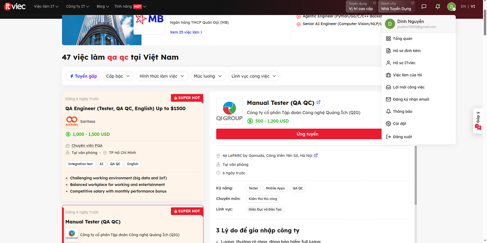
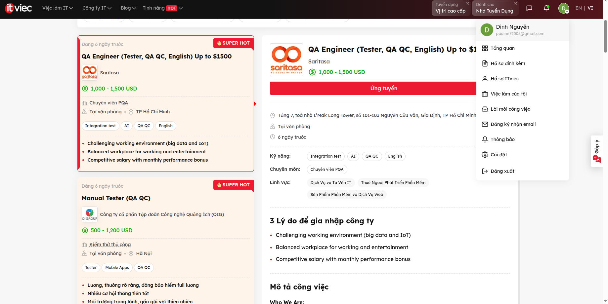
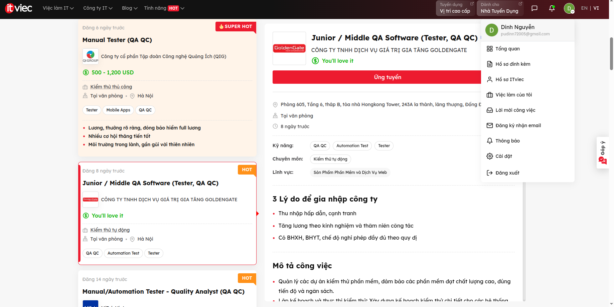
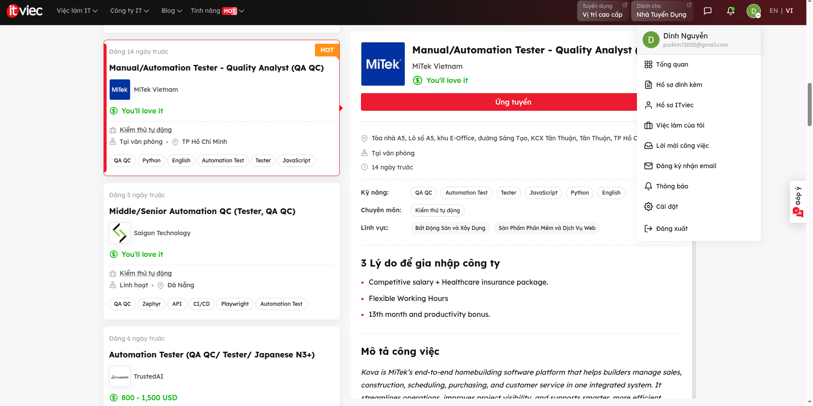
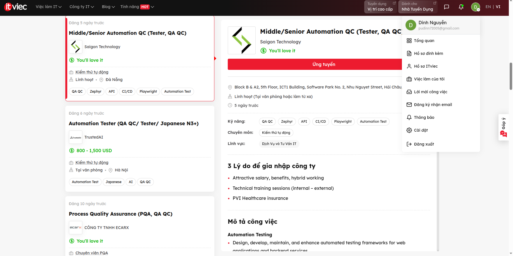
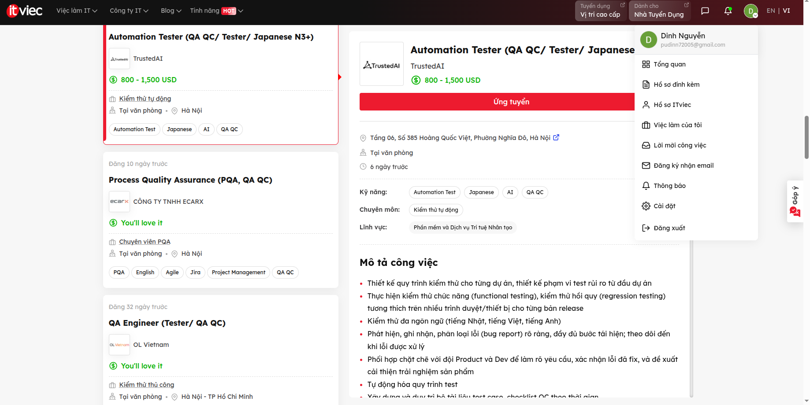
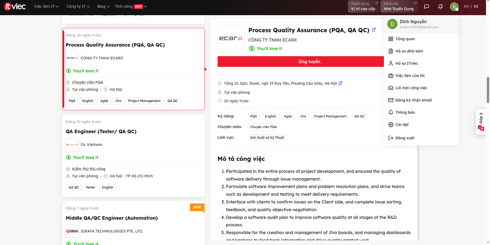
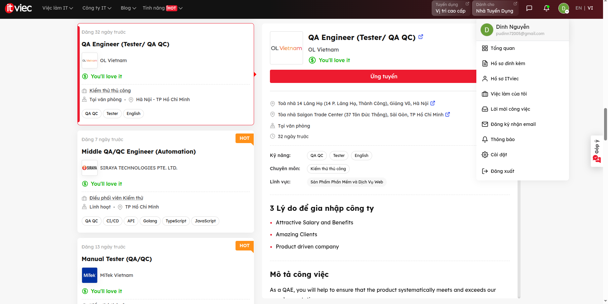
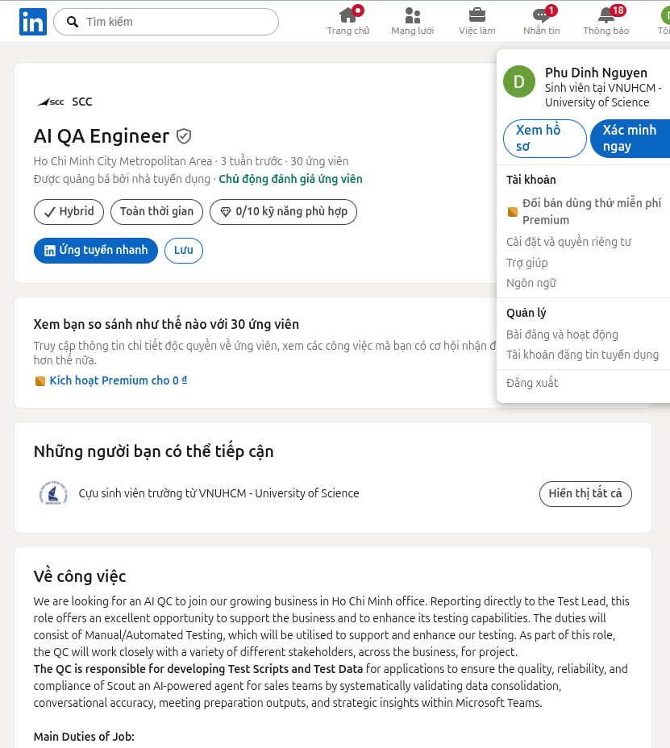
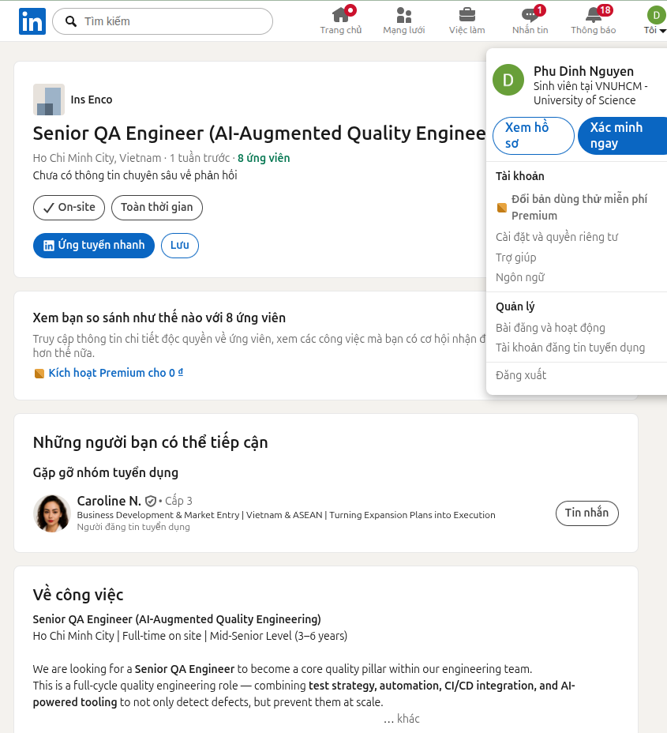

# Yêu cầu 1 — 10 tin tuyển dụng QA/QC (đăng trong vòng 60 ngày trước ngày nộp)

Yêu cầu: ≥ 3 tin đòi hỏi kỹ năng AI/LLM/automation-AI. Ảnh chụp phải hiện tên tài khoản.

- **Ngày chụp màn hình: 29/09/2026** (ITviec và LinkedIn chỉ hiển thị ngày đăng tương đối nên ngày đăng bên dưới là _ước tính_ = ngày chụp − số ngày hiển thị).
- Tài khoản trong ảnh: ITviec "Dinh Nguyễn"; LinkedIn "Phu Dinh Nguyen".
- Nội dung mô tả/yêu cầu bên dưới được AI (Claude Code, WebFetch) trích từ trang tin khi chưa đăng nhập, sau đó dịch/tóm tắt. Mô tả công việc của tin 02 do sinh viên chép nguyên văn từ trang.
- AI Impact Analysis do AI (Claude Code) soạn nháp dựa trên nội dung mô tả/yêu cầu của từng tin; sinh viên rà soát và chỉnh sửa (ghi trong AI Audit Report).
- Lương: ghi đúng như trang hiển thị nên đơn vị khác nhau (USD hoặc VND). Tin 7 lấy từ phần phúc lợi, tin 10 lấy từ phần mô tả tin; các tin còn lại không hiển thị lương ghi "Không công bố".

## Bảng tổng hợp

| #   | Công ty / Vị trí                                                 | Ngày chụp  | Lương                            | Yêu cầu AI? |
| --- | ---------------------------------------------------------------- | ---------- | -------------------------------- | ----------- |
| 1   | QIG — Manual Tester (QA QC)                                      | 29/09/2026 | 500–1,200 USD                    | Không       |
| 2   | Saritasa — QA Engineer (Tester, QA QC, English)                  | 29/09/2026 | 1,000–1,500 USD                  | Điểm cộng   |
| 3   | GoldenGate — Junior/Middle QA Software (Tester, QA QC)           | 29/09/2026 | Không công bố                    | Không       |
| 4   | MiTek Vietnam — Manual/Automation Tester – Quality Analyst       | 29/09/2026 | Không công bố                    | Không       |
| 5   | Saigon Technology — Middle/Senior Automation QC                  | 29/09/2026 | Không công bố                    | Điểm cộng   |
| 6   | TrustedAI — Automation Tester (QA QC / Japanese N3+)             | 29/09/2026 | 800–1,500 USD                    | **Có**      |
| 7   | ECARX — Process Quality Assurance (PQA, QA QC)                   | 29/09/2026 | Salary up to 50M+ Year-end bonus | Không       |
| 8   | OL Vietnam — QA Engineer (Tester/QA QC)                          | 29/09/2026 | Không công bố                    | Không       |
| 9   | SCC — AI QA Engineer                                             | 29/09/2026 | Không công bố                    | **Có**      |
| 10  | Ins Enco — Senior QA Engineer (AI-Augmented Quality Engineering) | 29/09/2026 | 30–40 triệu VND gross/tháng      | **Có**      |

## Chi tiết từng tin

### Tin 01 — QIG, Manual Tester (QA QC)

- **Link:** https://itviec.com/viec-lam-it/manual-tester-qa-qc-cong-ty-co-phan-tap-doan-cong-nghe-quang-ich-qig-3723
- **Ngày chụp:** 29/09/2026 — ngày đăng ước tính: ≈ 23/09/2026 (6 ngày trước)
- **Ảnh chụp:** 
- **Lương:** 500–1,200 USD
- **Mô tả công việc:** lập test plan, viết test case, chuẩn bị dữ liệu/môi trường test; thực thi kiểm thử, ghi nhận bug, đánh giá mức độ nghiêm trọng/ưu tiên, phối hợp dev; phân tích kết quả, làm báo cáo; đề xuất cải tiến quy trình test và sản phẩm; phân tích nghiệp vụ, tạo kịch bản test; đào tạo, chuyển giao cho bộ phận CSKH/vận hành.
- **Kỹ năng yêu cầu:** ≥ 2 năm kinh nghiệm test; hiểu quy trình, kỹ thuật kiểm thử; ưu tiên có kinh nghiệm test web/mobile và phần mềm nghiệp vụ phức tạp; cẩn thận, chịu khó học hỏi, làm việc nhóm tốt.
- **Yêu cầu AI:** Không
- **AI Impact Analysis:** AI có thể hỗ trợ sinh test case và dữ liệu test từ mô tả nghiệp vụ, nhưng việc phân tích nghiệp vụ, đánh giá mức độ nghiêm trọng của bug và đào tạo bộ phận CSKH vẫn cần con người. Tin không yêu cầu AI, tác động chủ yếu gián tiếp: nhà tuyển dụng có thể kỳ vọng năng suất cao hơn nhờ AI.

### Tin 02 — Saritasa, QA Engineer (Tester, QA QC, English)

- **Link:** https://itviec.com/viec-lam-it/qa-engineer-tester-qa-qc-english-up-to-1500-saritasa-4856
- **Ngày chụp:** 29/09/2026 — ngày đăng ước tính: ≈ 23/09/2026 (6 ngày trước)
- **Ảnh chụp:** 
- **Lương:** 1,000–1,500 USD
- **Mô tả công việc:** Who We Are:

We are a team of talented developers, architects, managers, engineers, designers, DevOps engineers, and QA engineers using brand-new tech to solve non-trivial tasks. We work on VR (Virtual Reality), AR (Augmented Reality), IoT (Internet of Things), web projects, mobile apps, Enterprise business applications, and Unity Gaming. We create projects using Python, С#, PHP, Objective-C, JavaScript (React, Vue.js, Angular), Java, and Swift and deploy them into AWS / Azure / Google Cloud.

We're all about collaboration so our teams review and test each other's code, providing regular feedback, and, in line with our Values, we're always improving.

Where We Are:

We believe a diverse range of backgrounds strengthens our team. We also have offices in the USA, Russia, and Vietnam. You will work in our office in Ho Chi Minh alongside our Russia-based teams.

- **Kỹ năng yêu cầu:** ≥ 3 năm Manual QA/Tester (ưu tiên có automation); nắm vững lý thuyết test; cẩn thận, tư duy phân tích; đọc hiểu spec; ghi bug kèm ảnh/video; công cụ JMeter/Postman, Git, Linux; kinh nghiệm test web/mobile, API; tiếng Anh tốt. Điểm cộng: dùng công cụ AI để tăng tốc thiết kế test ("Comfortable using AI tools to speed up test design and daily work").
- **Yêu cầu AI:** Điểm cộng
- **AI Impact Analysis:** Tin xem việc dùng công cụ AI để tăng tốc thiết kế test là điểm cộng, tức AI hỗ trợ (assist) chứ không thay thế. Các việc như đọc hiểu spec, test tích hợp/API và ghi bug kèm ảnh/video vẫn do tester thực hiện.

### Tin 03 — GoldenGate, Junior/Middle QA Software (Tester, QA QC)

- **Link:** https://itviec.com/viec-lam-it/junior-middle-software-qa-tester-qa-qc-cong-ty-tnhh-dich-vu-gia-tri-gia-tang-goldengate-4907
- **Ngày chụp:** 29/09/2026 — ngày đăng ước tính: ≈ 21/09/2026 (8 ngày trước)
- **Ảnh chụp:** 
- **Lương:** Không công bố
- **Mô tả công việc:** quản lý dự án kiểm thử đảm bảo chất lượng, tiến độ, ngân sách; lập và thực thi kế hoạch kiểm thử; phối hợp dev về yêu cầu và tương thích; liên tục tối ưu quy trình test; cung cấp báo cáo kiểm thử chi tiết.
- **Kỹ năng yêu cầu:** tốt nghiệp CNTT hoặc liên quan; ≥ 2 năm kinh nghiệm test; kinh nghiệm công cụ test/automation là lợi thế; khả năng phân tích, giải quyết vấn đề; làm việc độc lập và theo nhóm.
- **Yêu cầu AI:** Không
- **AI Impact Analysis:** Các việc lặp lại như viết báo cáo kiểm thử và test plan mẫu có thể được AI hỗ trợ, nên vị trí Junior dễ bị thu hẹp phần việc đơn giản. Quản lý tiến độ/ngân sách test và phối hợp với dev vẫn cần con người.

### Tin 04 — MiTek Vietnam, Manual/Automation Tester – Quality Analyst (QA QC)

- **Link:** https://itviec.com/viec-lam-it/manual-automation-tester-selenium-qa-qc-mitek-vietnam-0430
- **Ngày chụp:** 29/09/2026 — ngày đăng ước tính: ≈ 15/09/2026 (14 ngày trước)
- **Ảnh chụp:** 
- **Lương:** Không công bố
- **Mô tả công việc:** thiết kế/duy trì test case cho functional, regression, automation; viết và bảo trì automation script cho Web, Windows app, API; phát hiện, ghi nhận, theo dõi lỗi; debug script; làm việc với team Việt Nam và Mỹ; quản lý source control; refactor test.
- **Kỹ năng yêu cầu:** ≥ 3 năm test (manual + automation); kinh nghiệm automation Web/Windows/API; Agile; giải quyết vấn đề và giao tiếp tốt; tiếng Anh; nice-to-have: SQL, Postman, CI/CD, Python.
- **Yêu cầu AI:** Không
- **AI Impact Analysis:** AI code assistant có thể hỗ trợ viết, debug và refactor script automation cho Web/API, giúp giảm thời gian bảo trì. Thiết kế kịch bản test, test ứng dụng Windows và phối hợp với team Mỹ vẫn cần tester; script do AI sinh phải được review vì dễ thiếu ổn định.

### Tin 05 — Saigon Technology, Middle/Senior Automation QC

- **Link:** https://itviec.com/viec-lam-it/middle-senior-automation-qc-tester-qa-qc-saigon-technology-4350
- **Ngày chụp:** 29/09/2026 — ngày đăng ước tính: ≈ 24/09/2026 (5 ngày trước)
- **Ảnh chụp:** 
- **Lương:** Không công bố
- **Mô tả công việc:** thiết kế/bảo trì framework automation cho web và backend; xây dựng bộ test UI, API, integration, regression, E2E; cải thiện framework QC hiện có; báo cáo tình hình hằng tuần cho client; viết/thực thi test case, báo cáo và verify lỗi; phối hợp QC Lead, dev, architect, DevOps.
- **Kỹ năng yêu cầu** — bắt buộc: ≥ 4 năm Playwright; Page Object Model; JavaScript/TypeScript; tích hợp automation vào CI/CD; kiến thức API testing; thiết kế và chiến lược test; Zephyr hoặc Qase; tiếng Anh tốt.
- Điểm cộng (nice-to-have): Selenium/Cypress; **kinh nghiệm dùng AI trong automation test ("Experience in using AI in automating test scripts / test cases")**; framework multi-browser quy mô lớn; Postman.
- **Yêu cầu AI:** Điểm cộng
- **AI Impact Analysis:** AI trong automation là điểm cộng: AI có thể sinh nhanh script Playwright và Page Object, nhưng việc thiết kế framework, chiến lược test và review code do AI sinh vẫn thuộc về QC Senior. Vai trò dịch chuyển từ viết script sang thiết kế và kiểm duyệt.

### Tin 06 — TrustedAI, Automation Tester (QA QC / Tester / Japanese N3+)

- **Link:** https://itviec.com/viec-lam-it/automation-tester-qa-qc-tester-japanese-n3-trustedai-2550
- **Ngày chụp:** 29/09/2026 — ngày đăng ước tính: ≈ 23/09/2026 (6 ngày trước)
- **Ảnh chụp:** 
- **Lương:** 800–1,500 USD
- **Mô tả công việc:** thiết kế quy trình test và phạm vi test theo rủi ro cho từng dự án; test chức năng, hồi quy trên nhiều trình duyệt/thiết bị mỗi bản release; test đa ngôn ngữ (Nhật, Việt, Anh); phát hiện, ghi nhận, phân loại bug và theo dõi đến khi xử lý xong; phối hợp Product/Dev làm rõ yêu cầu; tự động hoá quy trình test; xây dựng bộ tài liệu test case, checklist QC.
- **Kỹ năng yêu cầu:** ≥ 3 năm kinh nghiệm tương đương (ưu tiên từng làm Test Lead); có kinh nghiệm phát triển; tự viết được test plan, test case, quy trình quản lý bug; tư duy logic, cẩn thận, chủ động; tiếng Nhật ≥ N3; đọc tài liệu kỹ thuật tiếng Anh; **kinh nghiệm automation testing và ứng dụng AI**; test sản phẩm AI/chatbot hoặc NLP là điểm cộng.
- **Yêu cầu AI:** **Có**
- **AI Impact Analysis:** Đây là tin yêu cầu AI trực tiếp: AI vừa là công cụ hỗ trợ automation, vừa là đối tượng phải test (chatbot/NLP). Test đa ngôn ngữ Nhật–Việt–Anh cần người kiểm chứng ngữ cảnh mà AI dễ đánh giá sai.

### Tin 07 — ECARX, Process Quality Assurance (PQA, QA QC)

- **Link:** https://itviec.com/viec-lam-it/process-quality-assurance-pqa-qa-qc-cong-ty-tnhh-ecarx-4345
- **Ngày chụp:** 29/09/2026 — ngày đăng ước tính: ≈ 19/09/2026 (10 ngày trước)
- **Ảnh chụp:** 
- **Lương:** Salary up to 50M+ Year-end bonus (nguyên văn phần phúc lợi của tin)
- **Mô tả công việc:** tham gia toàn bộ vòng đời dự án, đảm bảo chất lượng qua quản lý issue; xây kế hoạch cải tiến phần mềm và giải quyết vấn đề; làm việc với khách hàng để xác nhận issue, phân loại, phản hồi, thương lượng mục tiêu chất lượng; lập kế hoạch audit phần mềm cho các giai đoạn R&D; xây dựng và quản lý Jira board, dashboard, kanban; xây dựng hệ thống chất lượng đáp ứng yêu cầu khách hàng và ASPICE cấp cao hơn.
- **Kỹ năng yêu cầu:** cử nhân CNTT/Kỹ thuật phần mềm; ≥ 3 năm QA phần mềm; phương pháp test và Agile; tiếng Anh giao tiếp; giao tiếp, tư duy phản biện; chủ động, tự tin trình bày trong môi trường đa quốc gia.
- **Yêu cầu AI:** Không
- **AI Impact Analysis:** Tin không nhắc AI. AI có thể hỗ trợ tổng hợp báo cáo, dashboard Jira và checklist audit, nhưng thương lượng với khách hàng và xây dựng hệ thống chất lượng theo ASPICE cần phán đoán của con người, nên vai trò này ít bị thay thế nhất.

### Tin 08 — OL Vietnam, QA Engineer (Tester/QA QC)

- **Link:** https://itviec.com/it-jobs/qa-engineer-tester-qa-qc-ol-vietnam-3927
- **Ngày chụp:** 29/09/2026 — ngày đăng ước tính: ≈ 28/08/2026 (32 ngày trước)
- **Ảnh chụp:** 
- **Lương:** Không công bố
- **Mô tả công việc:** thiết kế và thực thi chiến lược manual test để phát hiện "90+% lỗi trước khi đến tay người dùng"; kiểm tra tính năng trên các bản release được hỗ trợ; đánh giá tính năng mới từ góc nhìn người dùng; đề xuất cải tiến sản phẩm và phương pháp.
- **Kỹ năng yêu cầu:** kinh nghiệm đáng kể manual test ứng dụng phức tạp; tiếng Anh nói/viết; nền tảng phát triển phần mềm; kỷ luật, giao đúng hạn. Nice-to-have: accessibility testing (WCAG), automation (Cypress/Selenium), scripting (TypeScript, Java, JavaScript, C#).
- **Yêu cầu AI:** Không
- **AI Impact Analysis:** Manual test ứng dụng phức tạp, đánh giá từ góc nhìn người dùng và accessibility (WCAG) khó thay bằng AI, chỉ được AI hỗ trợ sinh test case. Vì automation được xem là điểm cộng, ứng viên chỉ manual có áp lực phải nâng kỹ năng.

### Tin 09 — SCC, AI QA Engineer (LinkedIn)

- **Link:** https://www.linkedin.com/jobs/view/ai-qa-engineer-at-scc-4464451720/
- **Ngày chụp:** 29/09/2026 — ngày đăng ước tính: ≈ 08/09/2026 (3 tuần trước)
- **Ảnh chụp:** 
- **Lương:** Không công bố
- **Mô tả công việc:** rà soát tài liệu (Test Quality Matrix, tiêu chí Entry/Exit, báo cáo hằng ngày, báo cáo hoàn thành); thực hiện SIT và FAT với team UK; test chức năng tương tác chat AI và account insight của "Scout" (agent AI cho sales trong Microsoft Teams); test hợp nhất dữ liệu từ ZoomInfo, Sales Hub (CRM), web; đánh giá đầu ra chuẩn bị họp (tóm tắt, hồ sơ stakeholder); kiểm tra quy tắc xử lý xung đột và tuân thủ EU AI Act; test data adapter (xác thực, ánh xạ trường); ghi kết quả, phối hợp agile.
- **Kỹ năng yêu cầu:** cử nhân CNTT/Kỹ thuật/HTTT; 2–4 năm test phần mềm hoặc AI (manual + automation); quen Microsoft Teams, Azure AI, CRM; kinh nghiệm test giao diện hội thoại/ứng dụng AI; hiểu cơ chế xử lý xung đột AI và khuôn khổ tuân thủ; SIT/FAT; Agile; quản lý stakeholder.
- **Yêu cầu AI:** **Có**
- **AI Impact Analysis:** Đối tượng test là một AI agent (độ chính xác hội thoại, tuân thủ EU AI Act), nên AI không thể tự kiểm chứng chính nó. Nhu cầu QA cho hệ thống AI tăng, đòi hỏi kỹ năng đánh giá kết quả không xác định trước (non-deterministic).

### Tin 10 — Ins Enco, Senior QA Engineer (AI-Augmented Quality Engineering) (LinkedIn)

- **Link:** https://www.linkedin.com/jobs/view/senior-qa-engineer-ai-augmented-quality-engineering-4466589603/
- **Ngày chụp:** 29/09/2026 — ngày đăng ước tính: ≈ 22/09/2026 (1 tuần trước)
- **Ảnh chụp:** 
- **Lương:** 30–40 triệu VND gross/tháng
- **Mô tả công việc:** xây dựng chiến lược test kết hợp manual, automation, AI-assisted; shift-left; viết test case theo user story; exploratory và risk-based testing; xây bộ E2E bằng Playwright; API test bằng Postman/Bruno; tích hợp CI/CD (GitHub Actions/Jenkins); framework AI self-healing và visual regression; dùng GPT/Claude sinh test case/edge case, phân tích log lỗi bằng AI, dùng Postbot; giám sát chất lượng production (Sentry/Datadog); báo cáo và chỉ số chất lượng; performance baseline.
- **Kỹ năng yêu cầu** — bắt buộc: 3–6 năm QA; Playwright (E2E, CI, tracing); API testing (REST, GraphQL); SQL; Git, CI/CD; Jira + Xray/Zephyr; Agile. **AI-Essential:** kinh nghiệm thực tế với GPT/Claude để sinh và phân tích test; quen công cụ test AI (Mabl, Testim); visual AI testing (Applitools/Percy); Postbot. Nice-to-have: k6/Artillery, OWASP ZAP/Snyk, Sentry/Datadog, ISTQB (module AI testing).
- **Yêu cầu AI:** **Có**
- **AI Impact Analysis:** AI (GPT/Claude, Postbot, Mabl/Testim) có thể đảm nhận phần sinh test case, edge case và phân tích log lặp lại. QA chuyển sang thiết kế chiến lược, kiểm duyệt kết quả AI và tích hợp CI/CD — đây là mô hình QA "AI-augmented".
