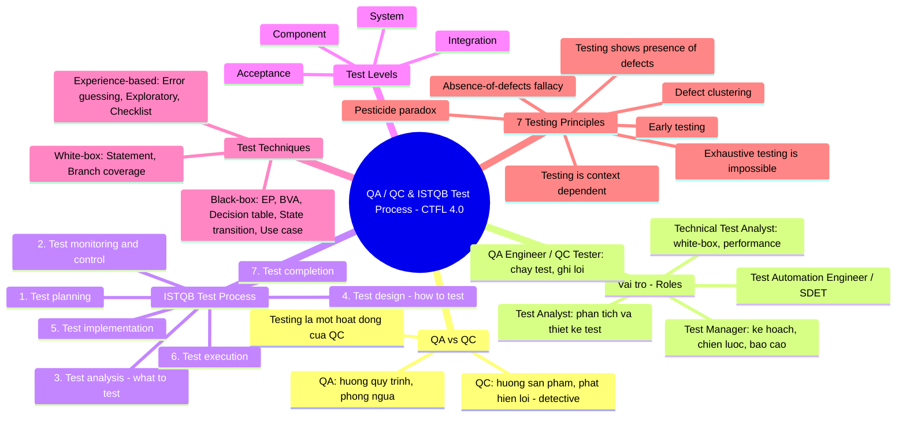
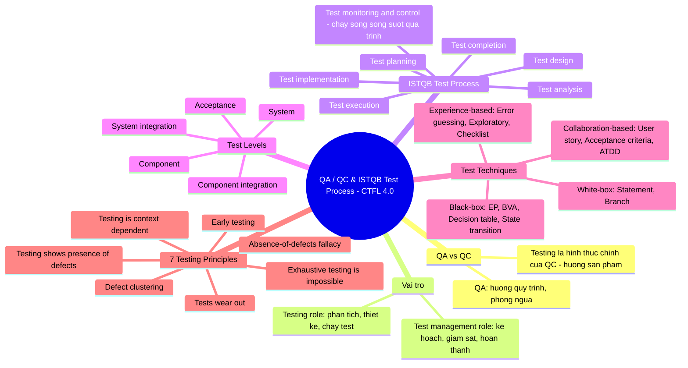

# Mindmap vai trò QA/QC và quy trình kiểm thử ISTQB (G9.1)

- **Công cụ AI:** Claude Code — Sonnet 5.5.
- **Prompt:** "... giờ hãy tạo mindmap QA/QC" (trích từ prompt; nguyên văn đầy đủ xem [ai/prompt_log.md](../../ai/prompt_log.md) Mục 16).
- **Ảnh:** [qa-qc-roles.png](qa-qc-roles.png) là bản gốc do AI tạo; [qa-qc-roles_annotated.png](qa-qc-roles_annotated.png) là bản đánh dấu lỗi (đỏ 1-2-3 là 3 lỗi chính, cam a-b-c là lỗi phụ).
- **Nguồn đối chiếu:** giáo trình ISTQB CTFL v4.0.1 (bản 2024-09-15), [PDF chính thức](https://istqb.org/wp-content/uploads/2024/11/ISTQB_CTFL_Syllabus_v4.0.1.pdf) trên istqb.org. Số trang theo chân trang của file PDF.

## 1. Mindmap do AI tạo (bản gốc, chưa sửa)

## 2. Ba lỗi chính tìm thấy

| # | AI viết | Đúng theo CTFL v4.0.1 | Căn cứ | Verdict |
|---|---|---|---|---|
| 1 | Test Levels có 4 mức: Component, Integration, System, Acceptance | Có **5 mức**: component, **component integration**, system, **system integration**, acceptance. Mức "integration" đã được tách đôi | §2.2.1 (tr. 28–29); danh sách thay đổi so với bản 2018 (tr. 75) | INVALID (thiếu 1 mức, dùng cách chia của bản cũ) |
| 2 | Kỹ thuật black-box có **Use case testing** | Black-box chỉ có 4 kỹ thuật: equivalence partitioning, boundary value analysis, decision table testing, state transition testing. Use case testing **đã bị bỏ** khỏi CTFL 4.0 (còn ở Advanced Test Analyst). Đồng thời mindmap thiếu nhóm **collaboration-based** (user story, acceptance criteria, ATDD) mới được thêm | §4.2 và §4.5; danh sách thay đổi (tr. 75) | INVALID (lẫn kiến thức bản cũ) và INCOMPLETE (thiếu nhóm mới) |
| 3 | "2. Test monitoring & control" đánh số như bước thứ 2 của một chuỗi tuần tự | Đây là nhóm hoạt động **chạy liên tục suốt quá trình test** ("ongoing checking of all test activities"). Giáo trình nói các hoạt động dù có vẻ theo trình tự logic nhưng "thường được thực hiện lặp hoặc song song" | §1.4.1 (tr. 18) | INCOMPLETE / MISLEADING (tên nhóm hoạt động đúng, nhưng cách vẽ gây hiểu sai) |

### Reasoning ngắn (sinh viên chỉnh lại bằng lời của mình)
- Lỗi 1 và 2 là lỗi **nội dung**: mindmap ghi nhãn "CTFL 4.0" nhưng dùng cách chia mức test và danh sách kỹ thuật khác với giáo trình 4.0.1. Giáo trình chỉ chứng minh nội dung khác nhau, không chứng minh được nguyên nhân bên trong khiến AI trả lời sai, nên bài không kết luận về nguyên nhân.
- Lỗi 3 là lỗi **biểu diễn**, không phải khẳng định rằng monitoring & control nằm ngoài quy trình test: cách đánh số 1–7 không thể hiện tính lặp/song song và tính liên tục của monitoring.

## 3. Ba lỗi phụ

| Ký hiệu | AI viết | Đúng theo CTFL v4.0.1 | Căn cứ |
|---|---|---|---|
| a | "Pesticide paradox" | Nguyên tắc 5 hiện tên là **"Tests wear out"** | §1.3 (tr. 17–18) |
| b | Vai trò "Technical Test Analyst" | Đây là vai trò của chương trình Advanced Level. CTFL v4.0 chỉ nêu **hai vai trò**: test management role và testing role | §1.4.5 (tr. 21) |
| c | QC là "detective" | Bản v4.0.1 mô tả testing là hướng sản phẩm, **"corrective"** (QA là hướng quy trình, phòng ngừa). Chỉ là khác thuật ngữ, không sai nội dung | §1.2.2 (tr. 17) |

## 4. Mindmap đã sửa (bản của sinh viên sau khi rà soát)

## 5. Ghi chú trung thực
- **Đã được kiểm chứng độc lập:** sinh viên nhờ một công cụ AI khác (Codex, GPT-5) đọc lại mindmap, đối chiếu với giáo trình chính thức và trích dẫn từng lỗi. Kết quả khớp với 3 lỗi chính ở mục 2; chi tiết và trích dẫn nguyên văn ở [ai/prompt_log.md](../../ai/prompt_log.md) Mục 17.
- Mindmap và phần đối chiếu đều do cùng một AI (Claude) thực hiện trong một phiên. Các lỗi trên đã được đối chiếu với file PDF chính thức, nhưng sinh viên cần tự mở giáo trình để xác nhận từng mục và số trang trước khi nộp.
- Mục này cần được ghi thành một mục trong [AI-02] AI Audit Report (prompt, output, verdict, reasoning, bản sửa).
